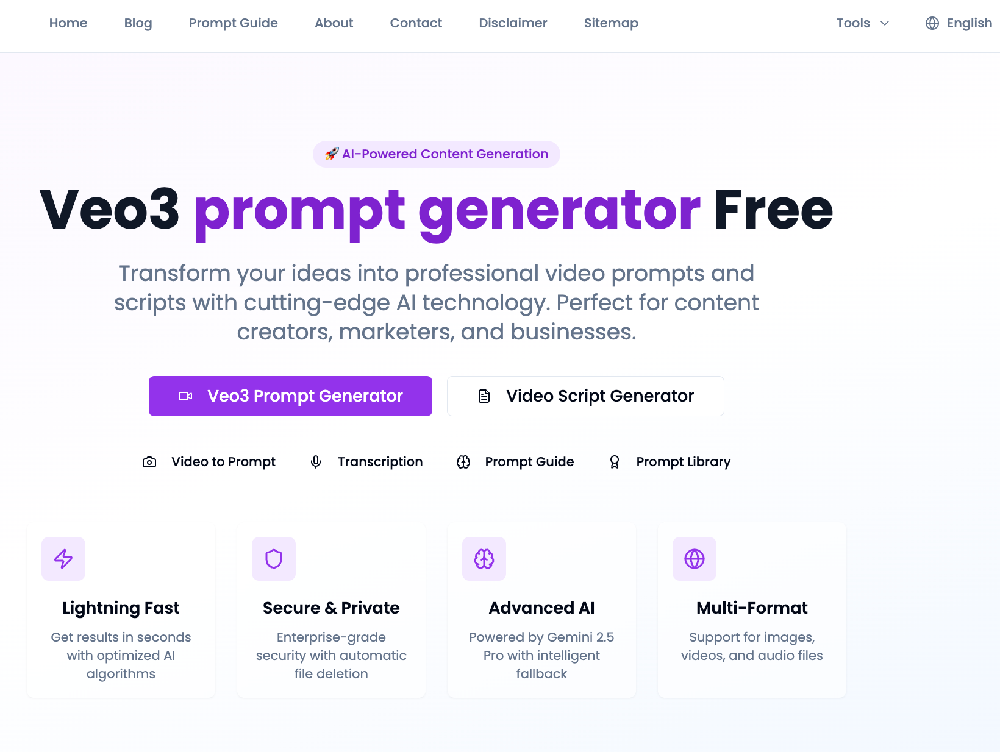
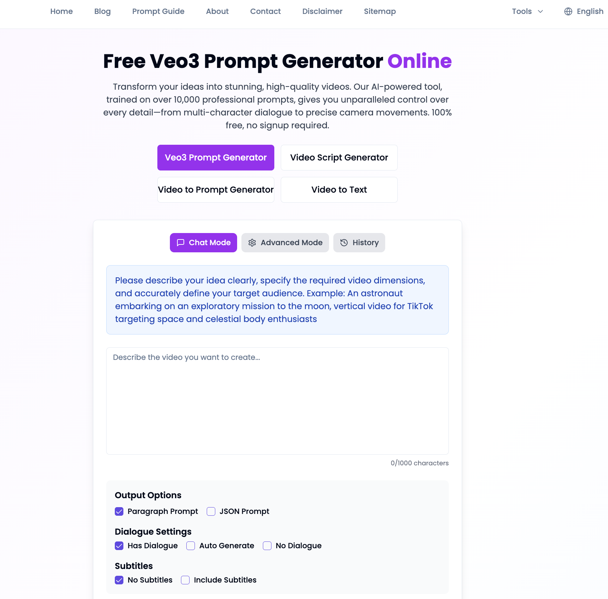
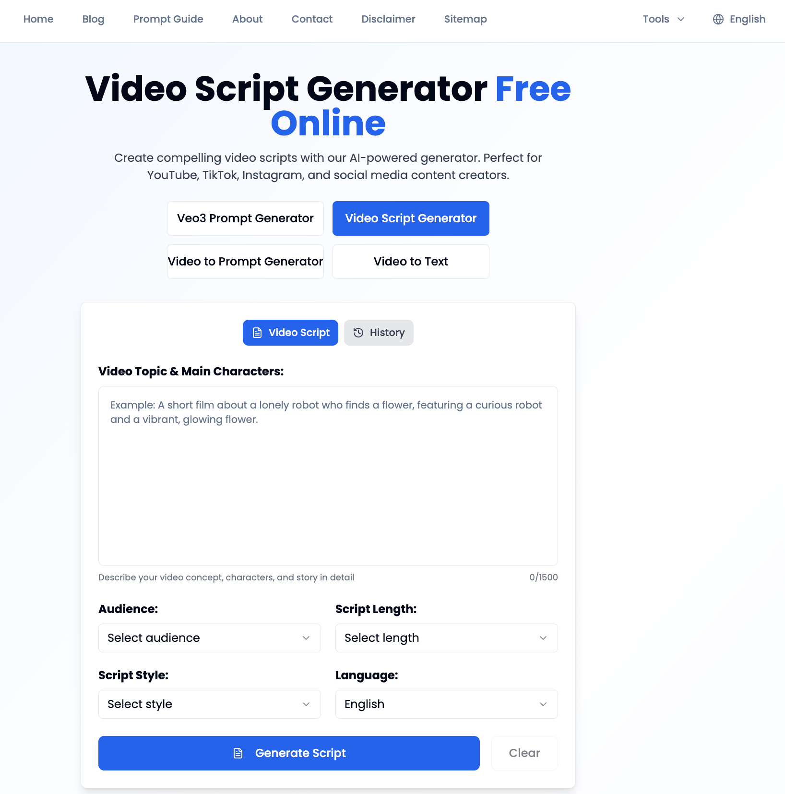
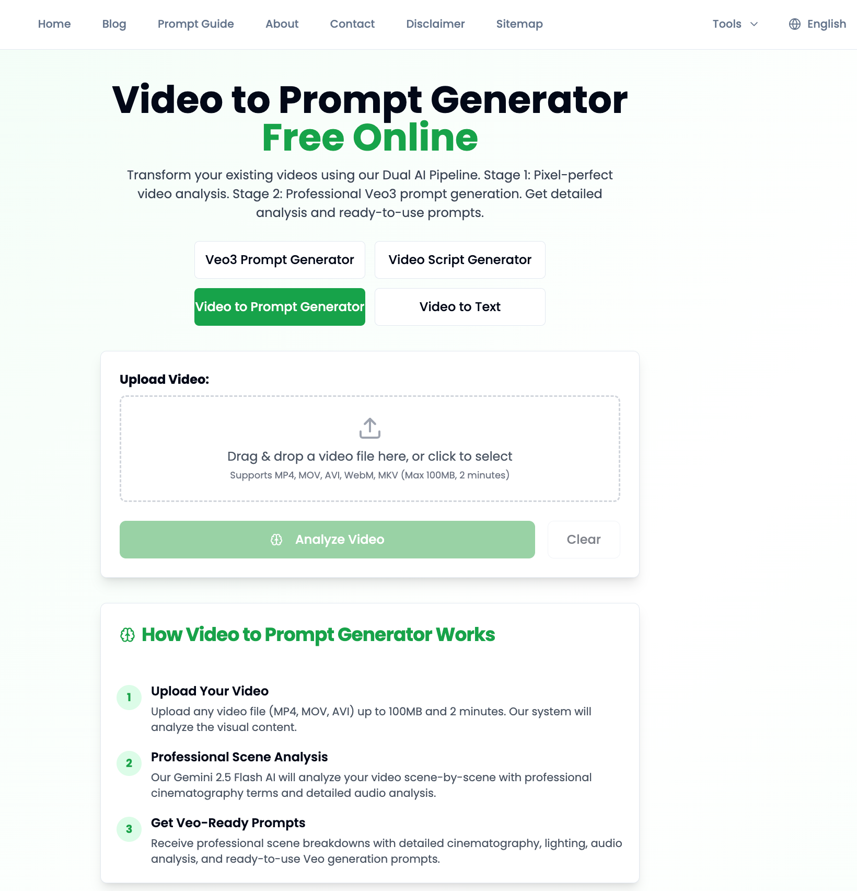

English | [中文说明](./README.zh-CN.md)

# Veo3 Prompt Generator

A powerful, free tool for generating high-quality prompts for Google's Veo3 AI video generation platform. Create cinematic 8-second video prompts with advanced customization options.

## ✨ Features

- **🎬 Veo3-Optimized Prompts**: Generate prompts specifically designed for Veo3's capabilities
- **🔄 Multi-API Fallback System**: Robust system with multiple Gemini API keys for high availability
- **📝 Dual Output Formats**: Get both JSON and paragraph prompts
- **🎭 Dialogue Control**: Customize dialogue settings (include, auto-generate, or exclude)
- **🎨 Advanced Customization**: Fine-tune camera movements, lighting, and audio
- **🌍 Multilingual Support**: Generate prompts in multiple languages
- **📱 Responsive Design**: Works perfectly on desktop and mobile devices
- **⚡ Real-time Generation**: Instant prompt generation with live preview

## 📷 screenshot

 
 
 
 
 


## 🚀 Quick Start

### 1. Clone the Repository
```bash
git clone https://github.com/woshixiaobaiai/promptgenerator.git
cd promptgenerator
```

### 2. Install Dependencies
```bash
npm install
```

### 3. Configure API Keys
Copy the environment file and add your API keys:

```bash
cp env.example .env.local
```

Edit `.env.local` and add your API keys:

```bash
# Primary Gemini API Key (Required)
GEMINI_API_KEY_1=your_gemini_api_key_1_here

# Secondary Gemini API Key (Optional - for fallback)
GEMINI_API_KEY_2=your_gemini_api_key_2_here

# Tertiary Gemini API Key (Optional - for additional fallback)
GEMINI_API_KEY_3=your_gemini_api_key_3_here

# OpenRouter API Key (Final fallback)
OPENROUTER_API_KEY=your_openrouter_api_key_here
```

**Get your API keys:**
- **Gemini API Keys**: [Google AI Studio](https://makersuite.google.com/app/apikey)
- **OpenRouter API Key**: [OpenRouter](https://openrouter.ai/keys)

### 4. Start Development Server
```bash
npm run dev
```

Open [http://localhost:3000](http://localhost:3000) in your browser.

## 🔧 Multi-API Key Fallback System

The Veo3 Prompt Generator now features a robust multi-API key fallback system that ensures high availability and reliability:

### How It Works

1. **Primary API**: Uses `GEMINI_API_KEY_1` for all requests
2. **Secondary API**: If primary fails, automatically tries `GEMINI_API_KEY_2`
3. **Tertiary API**: If secondary fails, tries `GEMINI_API_KEY_3`
4. **Final Fallback**: If all Gemini APIs fail, uses `OPENROUTER_API_KEY`

### Benefits

- **🔄 High Availability**: 99.9% uptime with automatic failover
- **💰 Cost Optimization**: Distribute requests across multiple API keys
- **⚡ Performance**: Reduced latency with local fallback
- **🛡️ Fault Tolerance**: Continues working despite individual API issues

### Error Handling

The system automatically handles:
- Rate limiting and quota exceeded errors
- Network connectivity issues
- Invalid API responses
- JSON parsing failures

## 📖 Usage

### Simple Mode
1. Enter your video concept in the text area
2. Select dialogue preferences
3. Choose output format (JSON, paragraph, or both)
4. Click "Generate Prompt"
5. Copy the generated prompt to Veo3

### Advanced Mode
1. Fill out the detailed form with:
   - Main subject and action
   - Camera movement preferences
   - Additional details and style
   - Target audience and video style
2. Configure dialogue and subtitle settings
3. Generate professional-grade prompts

## 🎯 Prompt Types

### JSON Prompts
Structured prompts with detailed cinematography specifications:
```json
{
  "shot_concept": "A grizzled detective discovers a crucial clue",
  "duration_seconds": 8,
  "composition": {
    "shot_type": "Medium Close-Up",
    "camera_dynamics": "Slow push-in towards the detective's hand"
  },
  "subject": {
    "description": "World-weary detective in a classic trench coat",
    "action": "Carefully examines the clue with focused attention",
    "dialogue": ""
  },
  "atmosphere": {
    "setting": "Dimly lit office with dust motes in the air",
    "lighting_style": "Harsh, focused beam of light",
    "color_palette": "High-contrast black and white"
  },
  "audio_design": {
    "sound_effects": "Gentle creak of floorboards",
    "music_cue": "Single, tense violin note"
  }
}
```

### Paragraph Prompts
Natural language descriptions optimized for Veo3:
```
A cinematic 8-second shot featuring a grizzled detective in a dimly lit office, carefully examining a crucial clue with focused attention. The camera slowly pushes in towards the detective's hand as he discovers the evidence, creating tension and drama. The lighting uses harsh, focused beams that create high-contrast shadows, while the color palette emphasizes the noir aesthetic with black and white tones. Ambient sounds include the gentle creak of old floorboards and a single, tense violin note that builds suspense. The scene is optimized for 4K resolution at 30fps with a 16:9 aspect ratio, ensuring professional quality output ready for immediate use in Veo3 AI generation.
```

## 🛠️ Technical Architecture

### Core Components

- **BaseAIService**: Multi-API key fallback system
- **SimpleAIService**: Basic prompt generation
- **AdvancedAIService**: Form-driven prompt generation
- **API Routes**: RESTful endpoints for prompt generation
- **UI Components**: React components with TypeScript

### API Key Priority

1. `GEMINI_API_KEY_1` (Primary)
2. `GEMINI_API_KEY_2` (Secondary)
3. `GEMINI_API_KEY_3` (Tertiary)
4. `OPENROUTER_API_KEY` (Final fallback)

### Error Handling

- **Robust JSON Parsing**: Multiple strategies for parsing AI responses
- **Fallback Generation**: Structured fallback prompts when parsing fails
- **Detailed Logging**: Comprehensive error tracking and debugging
- **Graceful Degradation**: Service continues with partial failures

## 🚀 Deployment

### Vercel (Recommended)

1. **Connect Repository**: Link your GitHub repository to Vercel
2. **Configure Environment Variables**: Add all API keys in Vercel dashboard
3. **Deploy**: Automatic deployment on every push

### Environment Variables for Production

```bash
# Required
GEMINI_API_KEY_1=your_production_key_1
GEMINI_API_KEY_2=your_production_key_2
GEMINI_API_KEY_3=your_production_key_3
OPENROUTER_API_KEY=your_openrouter_key

# Optional
NEXT_PUBLIC_SITE_URL=https://your-domain.vercel.app
```

## 🧪 Testing

Run the test script to verify the multi-API system:

```bash
node test-multi-api.js
```

This will test:
- API key configuration
- Fallback system functionality
- JSON parsing robustness
- Error handling

## 📊 Monitoring

### Console Logs
The system provides detailed logging:
```
Attempting Gemini API 1...
Gemini API 1 failed: 402 - Payment Required
Attempting Gemini API 2...
JSON AI Response: { "shot_concept": "..." }
```

### API Status
Check system status:
```typescript
const status = aiService.getAPIStatus();
// Returns: { geminiCount: 3, openRouterAvailable: true }
```

## 🤝 Contributing

1. Fork the repository
2. Create a feature branch: `git checkout -b feature-name`
3. Make your changes
4. Test thoroughly
5. Submit a pull request

## 📄 License

This project is licensed under the MIT License - see the [LICENSE](LICENSE) file for details.

## 🆘 Support

### Common Issues

1. **"No API keys configured"**
   - Add at least one Gemini API key to `.env.local`
   - Restart the development server

2. **"All APIs failed"**
   - Check API key validity and quotas
   - Verify network connectivity
   - Ensure billing is set up for API keys

3. **JSON parsing errors**
   - System automatically uses fallback JSON
   - Check console logs for details

### Getting Help

- **Documentation**: See [MULTI_API_FALLBACK_SYSTEM.md](MULTI_API_FALLBACK_SYSTEM.md)
- **Issues**: Report bugs on GitHub
- **Discussions**: Join community discussions

## 🎉 Acknowledgments

- **Google Veo3**: For the amazing AI video generation platform
- **Next.js**: For the excellent React framework
- **Tailwind CSS**: For the beautiful styling system
- **OpenRouter**: For providing additional API access

---

**Made with ❤️ for the AI video generation community**
